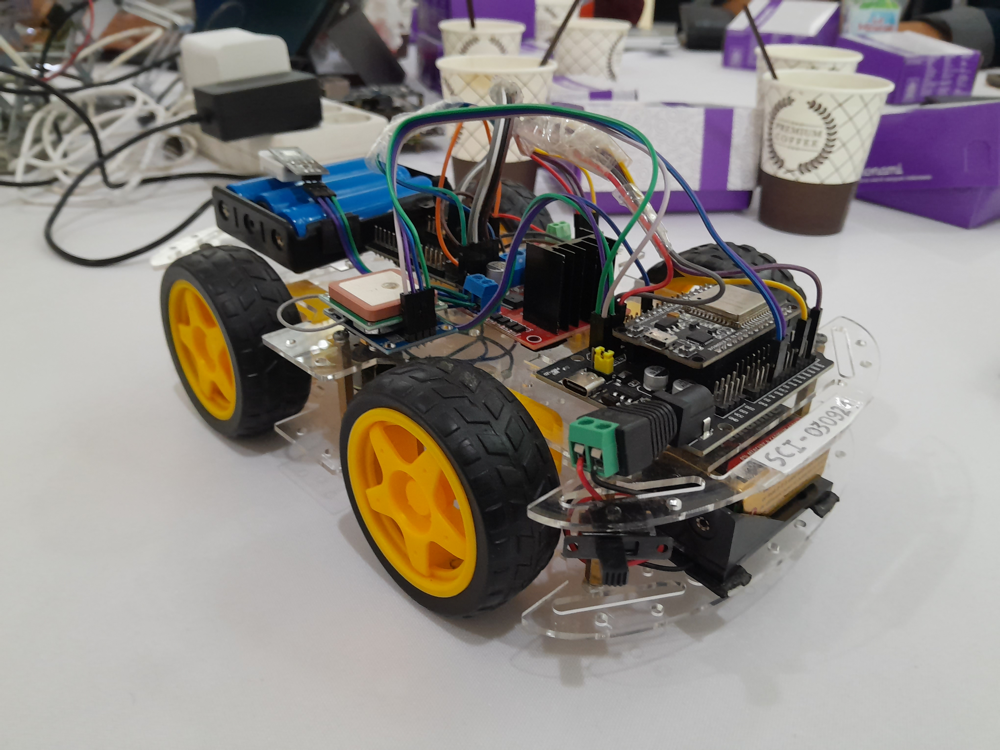

# TRIVE - IoT Part

Repositori ini berisi kode untuk prototipe mobil listrik (EV) yang kami buat. Prototype ini akan berperan sebagai miniatur EV yang bertugas untuk mengumpulkan data-data yang umumnya ada pada sebuah EV seperti temperatur baterai, tegangan, arus, dan juga data geo lokasi. Data-data tersebut kemudian akan dilempar ke database yang nantinya akan dikonsumsi oleh aplikasi android dan juga model mesin learningnya.



## Struktur folder
```
trive_car/
├─── data_controller/           # Berisi kode esp32 untuk mengumpulkan data pada sensor
│    ├── credential.cpp
│    ├── credential.cpp.example
│    ├── credential.h
│    └── data_controller.ino
│       
├─── docs/                      # Berisi dokumen tentang skema diagram
│    ├── car_image.jpg
│    ├── TRIVE CAR PROTOTYPE HARDWARE CONNECTIONS.pdf
│    └── TRIVE CAR PROTOTYPE HARDWARE CONNECTIONS.png
│
├─── motor_controller/          # Berisi kode esp32 untuk mengendalikan motor
│    ├── credential.cpp
│    ├── credential.h
│    ├── motor_controller.html
│    └── motor_controller.ino
│
├─── read_log/                  # Berisi kode untuk membaca serial monitor
│    ├── main.py
│    ├── requirements.txt
│    └── serial_log.txt
|
├─── .gitignore
└──- README.md
```

## Cara Menggunakan kode ini

1. Clone Repositori ini.
2. Ubah file `credential.cpp.example` pada direktori `data_controller` dan `motor_controller` menjadi  `credential.cpp`.
3. Isikan credential yang ada pada file tersebut.
4. Rangkai prototipe mobile. Ikuti skema diagram yang ada pada direktori `docs`.
5. Tinggal upload kodenya. Pastikan mengupload kode yang benar ke esp32.